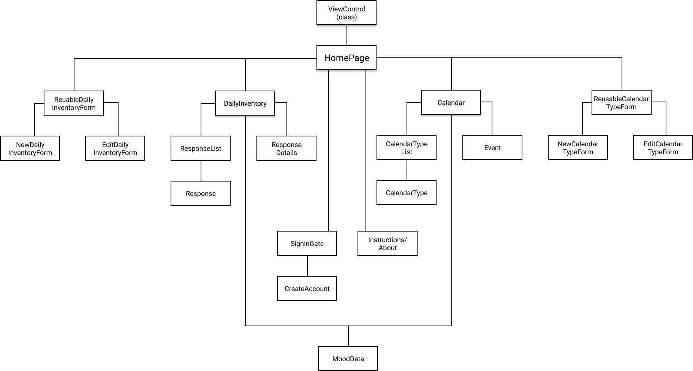
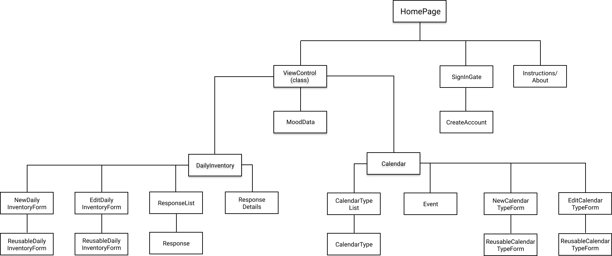

# Hack Your Health

### By Noel Kirkland - date

• 
• 
• 
• 
• 
•

## MVP with James - October 1st, 2020
* Progress report (MoodData) sounds like it will need to be a stretch goal.

* _Just the Calendar_ half or _just the DailyInventory_ half of my component tree would be a functioning application and should maybe be my MVP.
    - If I can create and flesh out either the Calendar part or the DailyInventory part in the first two days of capstone week then think about tying in the other half.

* Would like to incorporate authentication in my MVP but it could potentially eat up too much of my time

* James planned out his project where he anticipates to complete his MVP with an entire day remaining in the week.

* Pick a half to implement first. Build that half as if it was your entire project. If the whole half (either the Calendar or the DailyInventory half) is done. Styled, polished and everything

## Description

Hack your Health is an application that will help user's take charge of their mental health. The user will create calendars of all the things that they think would improve their mental health (e.g., exercise, meditation, social time, etc...) and enter the times they would like to do those activities. At the end of each day the user will fill out a personal inventory form that rates their mood (e.g., happiness, connectedness, piece of mind, etc...). The app will then compare all of the data and give digestible information on what activities are most beneficial to them. For example, let's say that the user has chosen meditation, yoga, and hiking as their chosen calendars. They add events for each of these calendars to their schedule and at the end of three weeks they have clocked 5 hours of meditation (20 minutes 5x per week for 3 weeks), 4.5 hours of yoga (30 minutes 3x per week for 3 weeks), and 2 hours of hiking (1 hour once a week for three weeks but they had to miss it one week). The user has also been rating daily inventory questions every night. Questions like, "how happy are you feeling today?", "how stressed are you feeling today?", "How is your depression today?". At the end of the three weeks they are left with comprehensive data about how these good things that they have chosen to do for themselves are actually affecting their mood in real time.

## Components

This is a list of all of the components I will need to complete my application:

* SignInGate
* CreateProfile

* ViewControl (only class component)

* HomePage

* Calendar
* CalendarType
* ReusableCalendarTypeForm
* NewCalendarTypeForm
* EditCalendarTypeForm

* DailyInventory
* ReusableDailyInventoryForm
* NewDailyInventoryForm
* EditDailyInventoryForm
* Response
* ResponseList

## Component tree diagram

#### First draft

#### Second draft

## Commands I have used so far

npm create-react-app hack-your-health

npm install

npm install firebase

npm install react-redux-firebase redux-firestore

npm install redux

npm install react-router-dom

## Production flow

create ViewControl

create HomePage

create all components in daily-inventory directory using only shared and local state

integrate redux

integrate firestore

create all components in calendar directory using the firestore off the bat

create SignInGate and CreateProfile component and make sure they are working correctly

style and polish

make sure readme is all up to date and polished

create demonstration video and get pitch down

#### eventual index.js
<!-- 
import React from 'react';
import ReactDOM from 'react-dom';
import App from './components/App';
import { ReactReduxFirebaseProvider } from 'react-redux-firebase';
import { createFirestoreInstance } from 'redux-firestore';
import firebase from "./firebase";
import { firestoreReducer } from 'redux-firestore';

const store = CREATE STORE COMES FROM REDUX SO I MIGHT NEED TO IMPLEMENT THAT IN ORDER FOR THIS WHOLE THING TO WORK
const rrfProps = {
  firebase,
  config: {
        userProfile: "users"
    },
  dispatch: store.dispatch,
  createFirestoreInstance
}

ReactDOM.render(
    <ReactReduxFirebaseProvider {...rrfProps}>
      <App />
    </ReactReduxFirebaseProvider>,
  document.getElementById('root')
)
 -->