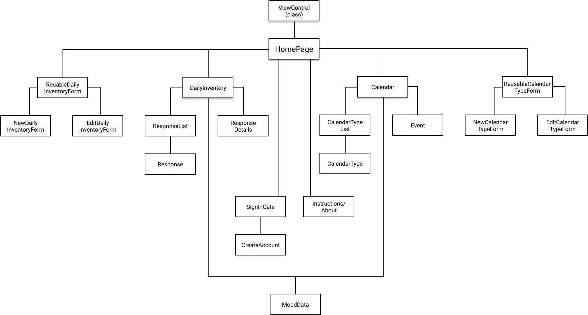
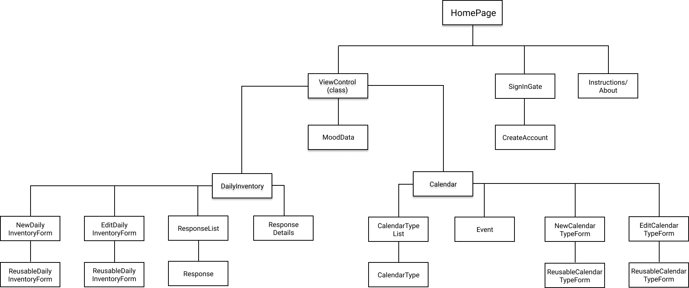
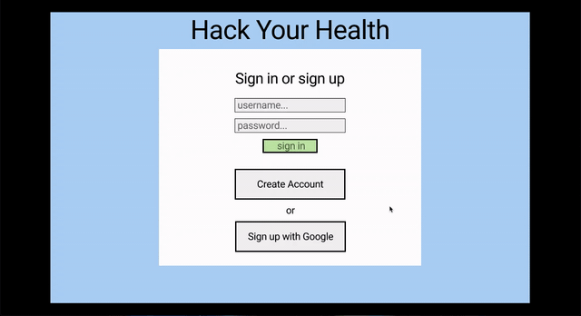

# Hack Your Health

### By Noel Kirkland - 10/7/2020

• 
• 
• 
• 
• 
•

## Description

Hack your Health is an application that will help user's take charge of their mental health. The user will create calendars of all the things that they think would improve their mental health (e.g., exercise, meditation, social time, etc...) and enter the times they would like to do those activities. At the end of each day the user will fill out a personal inventory form that rates their mood (e.g., happiness, connectedness, piece of mind, etc...). The app will then compare all of the data and give digestible information on what activities are most beneficial to them. For example, let's say that the user has chosen meditation, yoga, and hiking as their chosen calendars. They add events for each of these calendars to their schedule and at the end of three weeks they have clocked 5 hours of meditation (20 minutes 5x per week for 3 weeks), 4.5 hours of yoga (30 minutes 3x per week for 3 weeks), and 2 hours of hiking (1 hour once a week for three weeks but they had to miss it one week). The user has also been rating daily inventory questions every night. Questions like, "how happy are you feeling today?", "how stressed are you feeling today?", "How is your depression today?". At the end of the three weeks they are left with comprehensive data about how these good things that they have chosen to do for themselves are actually affecting their mood in real time.

## Components

This is a list of all of the components I will need to complete my application:

* ViewControl (only class component)

* HomePage

* authentication:
    * SignUp
    * SignIn

* calendar
    * Calendar
    * CalendarType
    * ReusableCalendarTypeForm
    * NewCalendarTypeForm
    * EditCalendarTypeForm

* daily inventory:
    * DailyInventory
    * DailyInventoryList
    * ReusableDailyInventoryForm
    * NewDailyInventoryForm
    * EditDailyInventoryForm
    * Response
    * ResponseList

* returned data
    * MoodData

## Component tree diagram

#### First draft:

#### Second draft:

## Prototype

This is a demonstration of the prototype I built in the planning stages of my project. As you can see the gif goes through the sign in gate and into the homepage. After that the demonstration simulates creating a custom inventory form and then filling out that form. Finally you can see the preview create a custom calendar type and then visit the calendar page.

## Commands I have used so far

npm create-react-app hack-your-health

npm install

npm install firebase

npm install react-redux-firebase redux-firestore

npm install redux

npm install react-router-dom

npm install react-redux

npm install styled-components

npm install react-bootstrap bootstrap

## Production flow

1. create ViewControl

2. create HomePage

3. create SignIn and SignUp components and make sure they are working correctly

4. create all components in daily-inventory directory and integrate redux

5. create all components in calendar directory

6. style and polish

7. make sure readme is all up to date and polished

8. create demonstration video and get pitch down

## Known bugs

Currently, the calendar half of my application has yet to be built out. Right now the user can create/edit/delete multiple daily inventory forms, fill out their custom forms and view their responses.
Once the calendar components have been built out I can use the data collected to create the MoodData component.

## Support and Contact Details

If there are any issues or questions contact me at noelkirkland@gmail.com

## Technologies Used 

* Javascript
* React
* React-Redux
* Firestore
* React-Bootstrap & Styled Components
* HTML & CSS
* Markdown

### License

`*` This project uses the following license: [MIT](https://opensource.org/licenses/MIT)

Intellectual property of Noel R. Kirkland - 2020